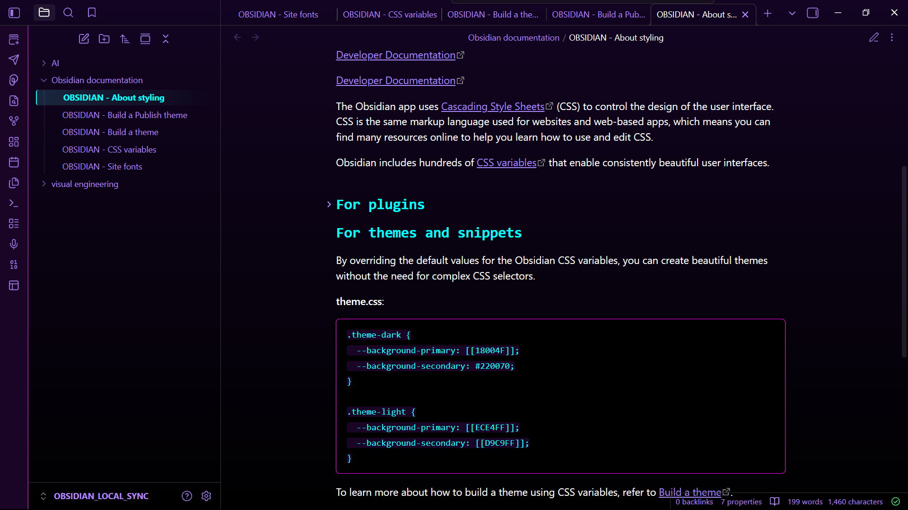
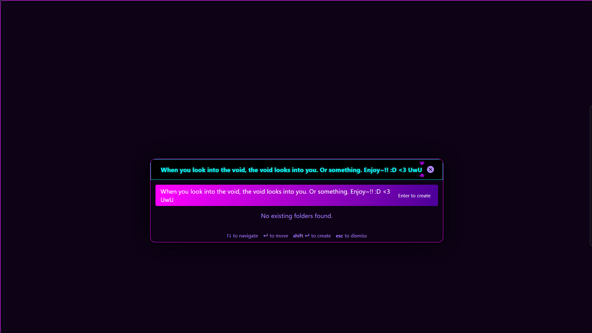
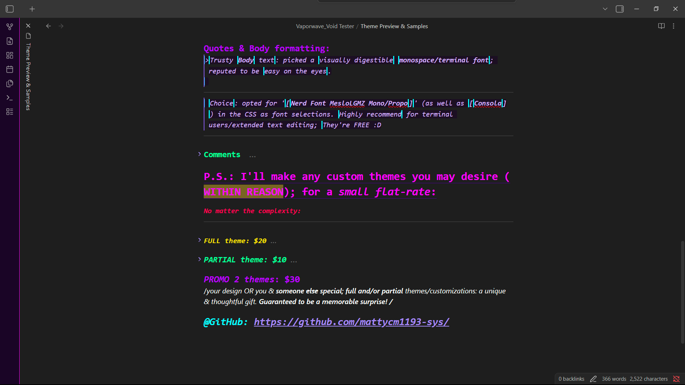
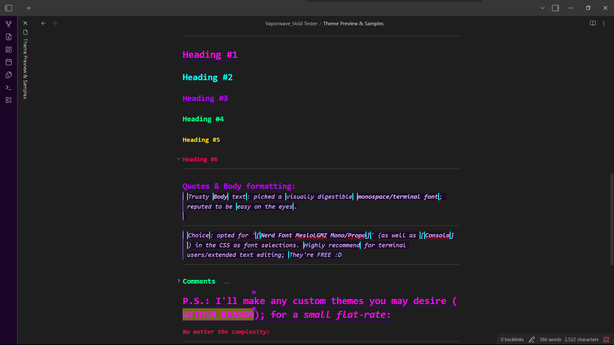
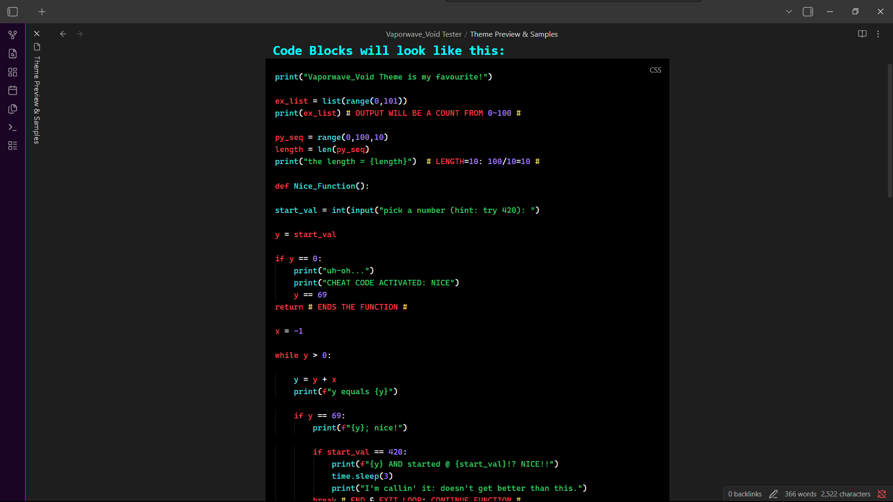
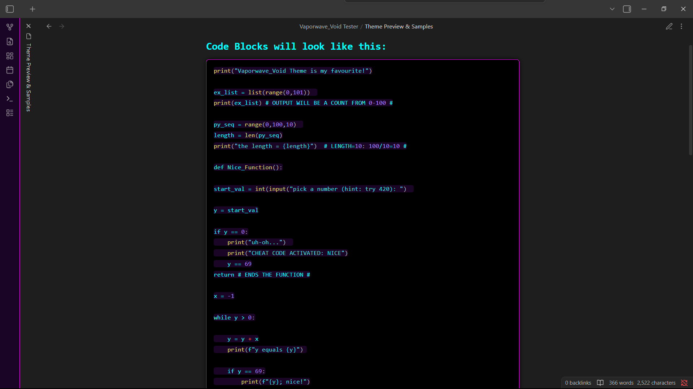
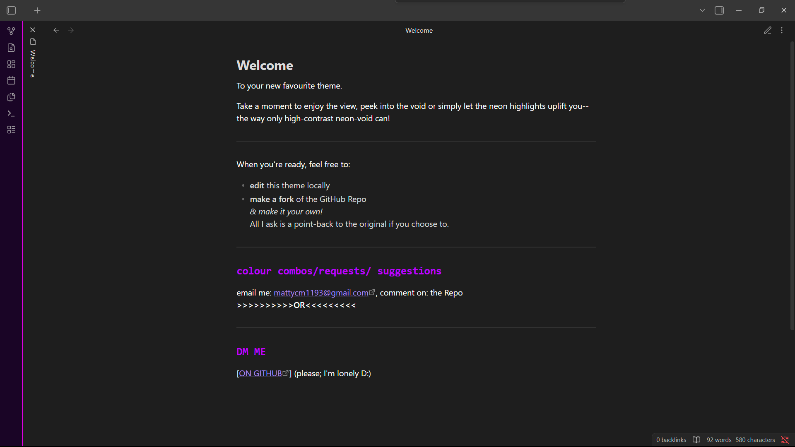

# Vaporwave Void - Obsidian Theme

A high-contrast, high-vapor, glass-morphism theme for Obsidian.md. 
Designed for deep work in the digital void.

  
  
  
  
  
  
  

## ⚠️ Important
**This theme is designed EXCLUSIVELY for Dark Mode.**
Please ensure Dark Mode is enabled in `Settings > Appearance`.

*(Note: Using Light Mode will result in invisible text, as the neon variables are strictly bound to the dark theme class.)*

## Features
* **Glass-Morphism:** Translucent panes over a deep purple-to-black void gradient.
* **Neon Hierarchy:**
    * **H1:** Hot Pink
    * **H2:** Electric Cyan
    * **H3:** Nuclear Purple
    * **H4:** Neon Lime
    * **H5:** Sunset Gold
    * **H6:** Radical Red
* **Cyber-Swatches:** Custom neon styling for color inputs.
* **Semantic Consistency:** Full support for file explorer plugins and modal windows.

## Installation

### Manual Installation (Right Now)
1. Download the `theme.css` and `manifest.json` files from this repository.
2. Open your Obsidian Vault folder.
3. Navigate to `.obsidian/themes/` (you may need to enable "Show Hidden Files" on your OS).
4. Create a new folder named `Vaporwave Void`.
5. Paste the files into that folder.
6. Open Obsidian > Settings > Appearance and select **Vaporwave Void**.

### Community Store (Coming Soon)
Once approved by the Obsidian team:
1. Open Obsidian Settings > Appearance > Themes.
2. Click "Manage".
3. Search for "Vaporwave Void".
4. Click "Install" and then "Use".

## License
MIT License